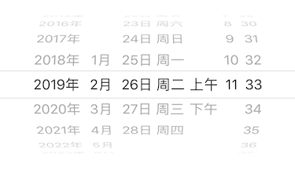

# LXDateTimePicker

[](https://travis-ci.org/949478479/LXDateTimePicker)
[](https://cocoapods.org/pods/LXDateTimePicker)
[](https://cocoapods.org/pods/LXDateTimePicker)
[](https://cocoapods.org/pods/LXDateTimePicker)

支持【年】、【月】、【年月】、【年月日】、【时分】、【年月日时分】的日期选择器。



```
pod 'LXDateTimePicker'
```

```swift
import LXDateTimePicker

let picker = DateTimePicker { (config) in
    config.mode = .hourMinute
    config.use12HourClock = true
}

addSubview(picker)
```

```swift
let dateComponents = picker.dateComponents

print(dateComponents.date)
print(dateComponents.year)
print(dateComponents.month)
print(dateComponents.day)
print(dateComponents.weekDay)
print(dateComponents.hour)
print(dateComponents.minute)
print(dateComponents.period)
```